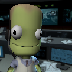

# GeneKermanBot
 

**GeneKermanBot** is a Discord bot designed to track and manage playtime for Kerbal Space Program (KSP) players and provide interactive mini-games. This bot integrates with Discord’s API to monitor user activities and offer engaging game scenarios.

## Features

### KSP Play Time Tracker
- **Tracks Play Time**: Monitors when users start and stop playing KSP.
- **Announces Top Players**: Sends periodic updates on the top players based on their total playtime.
- **Event Notifications**: Notifies the community about game activity in a designated channel.

### Mini-Game Command
- **Interactive Mini-Games**: Provides fun scenarios with questions and multiple-choice answers.
- **Random Outcomes**: Generates responses based on user choices and predefined outcomes.

## Requirements
- Python 3.8 or higher
- discord.py library
- python-dotenv library

## Installation

### Clone the Repository
```sh
git clone https://github.com/yourusername/Gene-Kerman-Bot.git
cd Gene-Kerman-Bot
```

## Install Dependencies
```sh
pip install -r requirements.txt
```

## Create Necessary Files
Ensure you have the following files in the root directory:
- `play_times.json` (for tracking play times)
- `scenarios.json` (for mini-game scenarios)

## Usage
To start the bot, run the following command:
```sh
py minigame.py
py GeneKerman.py
```

## Configuration
- **Play Time Tracking**: The bot will announce top players in the `ksp-log` channel.
- **Mini-Game Command**: Use `!minigame` to start the mini-game.

## Contributing
Feel free to submit issues or pull requests if you have suggestions or improvements.

## License
This project is licensed under the MIT License. See the [LICENSE](LICENSE) file for details.

## Contact
For questions or support, please contact cubukcagri561@gmail.com.
